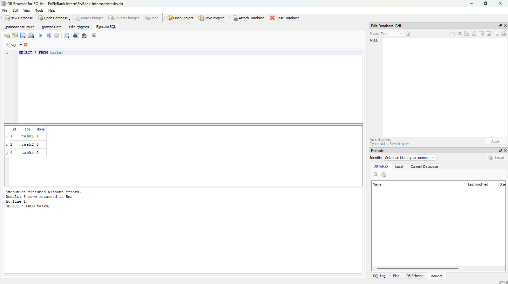

# Task API

A simple RESTful Task API built with **Node.js**, **Express**, and **Swagger UI**. It supports creating, reading, updating, and deleting tasks (CRUD) with basic request validation.

---

## Features

- RESTful CRUD API
- Request validation
- JSON responses
- Swagger UI documentation
- SQLite database for persistent storage

---

## Technologies

- Node.js
- Express.js
- SQLite
- Swagger UI Express
- OpenAPI 3.0

---

## Why SQLite?

SQLite was chosen because it stores the entire database in a **single file**, requires **zero setup**, and preserves data between server restarts. These features make it an excellent choice for small projects and learning REST API development.

---

## Database

The application automatically creates a SQLite database file named:

```text
tasks.db
```

The database file is created automatically when the project is run for the first time. It is usually added to `.gitignore` so each clone of the repository starts with a fresh database.

### Database Screenshot

> **📷 Insert DB Browser for SQLite screenshot here**

```text
[ DB Browser Screenshot ]
```

---

## Installation

Clone the repository:

```bash
git clone https://github.com/Leklaka-Abdelmoaty/FlyRank-Intern.git
```

Move into the project:

```bash
cd FlyRank-Intern/BE-02
```

Install dependencies:

```bash
npm install
```

---

## Run

Start the server using:

```bash
node "Build your first CRUD API.js"
```

The API will be available at:

```
http://localhost:3000
```

Swagger UI:

```
http://localhost:3000/docs
```

---

# API Endpoints

| Method | Endpoint | Description |
|---------|----------|-------------|
| GET | `/` | API information |
| GET | `/health` | Health check |
| GET | `/tasks` | Get all tasks |
| GET | `/tasks/:id` | Get a task by ID |
| POST | `/tasks` | Create a new task |
| PUT | `/tasks/:id` | Update a task |
| DELETE | `/tasks/:id` | Delete a task |

---

# Example cURL Request

```bash
curl -i -X POST http://localhost:3000/tasks -H "Content-Type: application/json" -d "{\"title\":\"Buy milk\"}"
```

Example output:

```http
HTTP/1.1 201 Created
X-Powered-By: Express
Content-Type: application/json; charset=utf-8
Content-Length: 41
ETag: W/"29-xxxxxxxxxxxxxxxx"
Date: Tue, 21 Jul 2026 12:00:00 GMT
Connection: keep-alive
Keep-Alive: timeout=5

{
  "id": 4,
  "title": "Buy milk",
  "done": false
}
```

---

# Swagger UI

Open:

```
http://localhost:3000/docs
```

## Swagger Demo


<<<<<<< HEAD

---

# Example SQL Query (Stage 4)

The following query was used during Stage 4 to retrieve all tasks from the database:

```sql
SELECT * FROM tasks;
```

### SQL Query Screenshot



=======
>>>>>>> main

---

# Project Structure

```text
BE-02/
│
├── Build your first CRUD API.js
├── openapi.json
├── tasks.db
├── package.json
├── package-lock.json
└── README.md
```

---

# Notes

<<<<<<< HEAD
- Data is stored in a SQLite database.
- The database file (`tasks.db`) is created automatically.
- SQLite preserves data between server restarts.
- API documentation is generated using OpenAPI 3.0 and served with Swagger UI.
=======
- Data is stored in memory.
- Restarting the server resets the task list.
- API documentation is generated using OpenAPI 3.0 and served with Swagger UI.
>>>>>>> main
