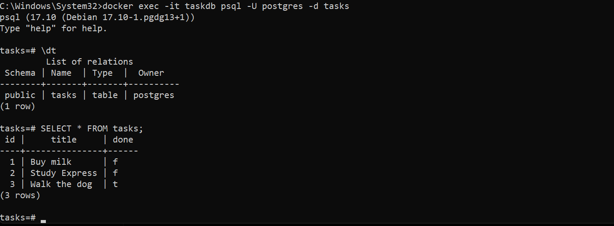

# Task API

A RESTful Task API built with Node.js, Express, and PostgreSQL. It supports creating, reading, updating, and deleting tasks (CRUD). The application runs together with PostgreSQL using Docker Compose.
## Run the project

```bash
docker compose up
```
## Environment Variables

Copy `.env.example` to `.env` and update the values if needed.

## API Endpoints

| Method | Endpoint | Description |
|--------|----------|-------------|
| GET | /tasks | Get all tasks |
| GET | /tasks/:id | Get a task by ID |
| POST | /tasks | Create a task |
| PUT | /tasks/:id | Update a task |
| DELETE | /tasks/:id | Delete a task |

## One pasted curl -i

### Request : get /tasks/1

```bash
curl -i http://localhost:3000/tasks
```
### Request : get /tasks/99

```bash
curl -i http://localhost:3000/tasks/99
```
### Request : successful POST

```bash
curl -i -X POST http://localhost:3000/tasks -H "Content-Type: application/json" -d '{"title":"Buy milk"}'
```
### Request : missing title

```bash
curl -i -X POST http://localhost:3000/tasks -H "Content-Type: application/json" -d '{}'
```
### Request : update task (replace title and/or done)

```bash
curl -i -X PUT http://localhost:3000/tasks/3 -H "Content-Type: application/json" -d '{"title":"Checkpoint2 updated","done":true}'
```
### Request : update with empty/invalid body

```bash
curl -i -X PUT http://localhost:3000/tasks/3 -H "Content-Type: application/json" -d '{}'
```
### Request : update unknown id

```bash
curl -i -X PUT http://localhost:3000/tasks/99 -H "Content-Type: application/json" -d '{"title":"Does not exist"}'
```
### Request : delete task

```bash
curl -i -X DELETE http://localhost:3000/tasks/3
```
### Request : delete unknown id

```bash
curl -i -X DELETE http://localhost:3000/tasks/99
```
## Database Screenshot


